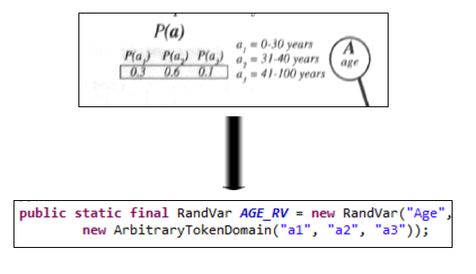
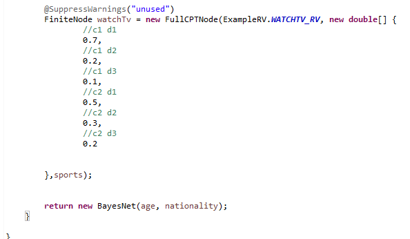
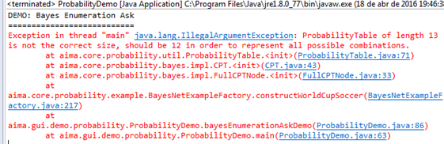
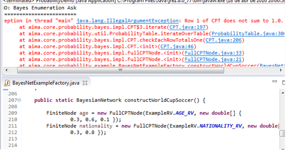
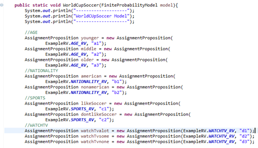

# aima-java-bayesNetwork
The goal here is to show an example of usage of bayes network with variables that aren't booleans.

The AIMA project in python doesn't provide bayesian network in others domains different from booleans.
Fortunately, Java does. This repository will explain some packages and show the solution of the BN below (World Cup Soccer). 

### aima.core.probability.domain

This package has the domains used to define our variables. So, we can use the ArbitraryTokenDomain to define our variables as "a1,a2,b2,c1".

### aima.core.probability.example

***ExampleRV.java***

With this package, we can find the file ExampleRV.java that defines the random variables, using the domain ArbitraryTokenDomain. (This package also has the book (AIMA 3 ) examples of weather, toothache.

We can map the age variable easily:

Now, the others variables:

***BayesNetExampleFactory.java***

Here, its defined the CPT of variables. Age and nationality are independent. We just need to create a array with the table values:

The var sports depends of the values of age and nationality. The product of age var length (a1,a2,a3) with nationality (b1,b2) and sports(c1 , c2) guarantee the 12 values of probability of the table.

WatchTv depends on sports values:

*** Class FullCPTNode ***

FucllCPTNode class its very important. It´s has three parameters on its constructor: 
1) The random variable
2) An array of values
3) Dependent variables

** Errors while constructing CPTs **
Its common having two kind of errors at this step:

When you try to insert more values than allowed to the table:

When the sum of values is different from 1:

### aima.gui.demo.probabilty
This package has the class with main method to run the probabilities algorithms.
Here, there is an importante class called AssignProposition that gives the variables some meaning to make querires easier:  

