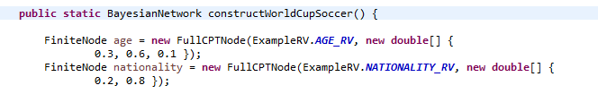

# aima-java-bayesNetwork
The goal here is to show an example of usage of bayes network with variables that aren't booleans.

The AIMA project in python doesn't provide bayesian network in others domains different from booleans.
Fortunately, Java does. This repository will show the solution of the BN below (World Cup Soccer). 

To solve the BN below (World Cup Soccer), we need to use the Token Domains. 

### aima.core.probability.domain

This package has the domains used to define our variables. So, we can use the ArbitraryTokenDomain to define our variables as "a1,a2,b2,c1".

### aima.core.probability.example

***ExampleRV.java***
With this package, we can find the file ExampleRV.java that defines the random variables, using the domain ArbitraryTokenDomain. (This package also has the book (AIMA 3 ) examples of weather, toothache.

We will define ours RV age, nationality, sports and watchTV

***BayesNetExampleFactory.java***
Here, its defined the CPT of variables. Age and nationality are independent. We just need to create a array with the table values:

The var sports depends of the values of age and nationality. The product of age var length (a1,a2,a3) with nationality (b1,b2) and sports(c1 , c2) guarantee the 12 values of probability of the table.

